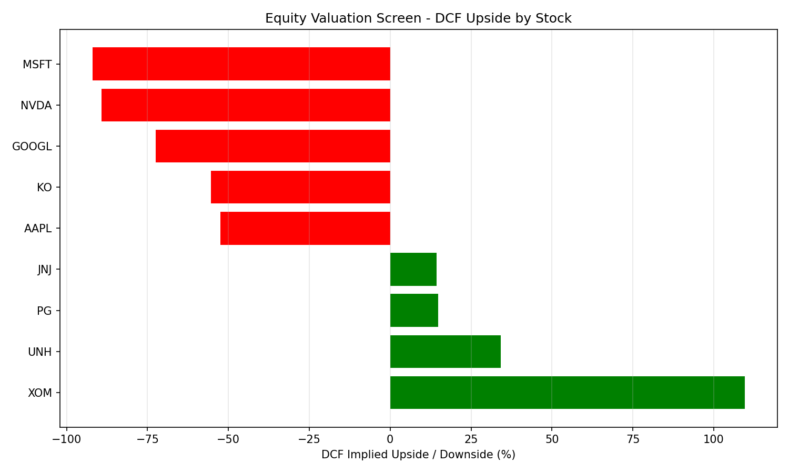

# Equity Valuation Toolkit

Stock valuation in Python: DCF (WACC from CAPM, Gordon terminal value),
EV/EBITDA comparables and a sensitivity table, on 10 large US stocks.

  

## What it does

- **DCF:** free cash flow projected over 5 years, discounted at the WACC (cost
  of equity from CAPM, after-tax cost of debt), Gordon terminal value with
  2.5% growth.
- **Comparables:** the median EV/EBITDA of the group applied to each
  company's EBITDA.
- **Sensitivity:** DCF value per share across WACC and terminal growth, for
  the largest stock in the group.

Universe: AAPL, MSFT, GOOGL, JPM, XOM, JNJ, PG, KO, NVDA, UNH.

## Run

```bash
pip install -r requirements.txt
python equity_valuation.py
```

Results are written to `output/`.

## Results



| Ticker | Price | WACC | DCF value | DCF upside | Comps value | Comps upside |
|---|---:|---:|---:|---:|---:|---:|
| XOM | 153.04 | 4.8% | 320.69 | +109.5% | 310.01 | +102.6% |
| UNH | 407.08 | 6.6% | 545.97 | +34.1% | 471.69 | +15.9% |
| PG | 145.79 | 5.7% | 167.40 | +14.8% | 195.25 | +33.9% |
| JNJ | 259.24 | 5.1% | 296.25 | +14.3% | 268.73 | +3.7% |
| AAPL | 313.33 | 9.3% | 148.66 | -52.6% | 221.55 | -29.3% |
| NVDA | 223.96 | 15.0% | 24.12 | -89.2% | 134.11 | -40.1% |

NVDA sensitivity (value per share, `output/sensitivity_NVDA.csv`): from
$19.9 (WACC 17%, g 1.5%) to $31.0 (WACC 13%, g 3.5%).

## How to read these numbers

The extreme gaps say more about the method than about the stocks:

- **Growth stocks** (NVDA, MSFT, AAPL): a 5-year DCF with 2.5% terminal
  growth cannot capture double-digit expected growth, so the values are far
  below the market price.
- **Low WACC** (XOM, about 4.8%): a low beta pushes the terminal value up a
  lot. In practice a floor on the risk premium would be used.
- **JPM has no value:** Yahoo Finance gives no usable free cash flow or
  EBITDA for a bank, and these methods do not apply to banks anyway (debt is
  part of the business, not just financing). Banks are valued on P/B, P/E or
  dividends.
- Yahoo Finance data is real but not adjusted (no analyst consensus, no
  one-off items removed).

## Stack

Python, NumPy, pandas, SciPy, Matplotlib, yfinance

## License

MIT, see [LICENSE](LICENSE).
